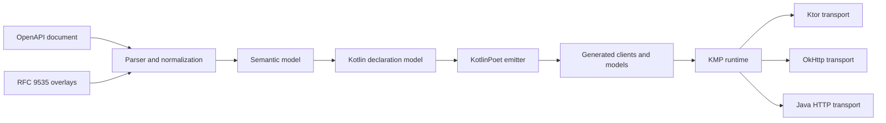

# Kotlin SDKGen

OpenAPI 3.1 SDK generation for Kotlin and Kotlin Multiplatform, with typed clients, portable runtime
transports, deterministic output, and compatibility tooling designed for long-lived APIs.

> [!IMPORTANT]
> Kotlin SDKGen is a **production-oriented preview**. It is exercised against large real-world API
> descriptions, but no artifact has been published to Maven Central or the Gradle Plugin Portal yet.
> Build from source to evaluate it. Public APIs may change before the first release.

## Why Kotlin SDKGen?

SDK generation is easy when an API contains only flat JSON objects and ordinary request/response pairs.
The difficult parts are preserving wire semantics across composition, optionality, pagination, streaming,
multipart bodies, authentication, and future schema evolution—without leaking generator machinery into the
consumer's public API.

Kotlin SDKGen focuses on those boundaries:

- OpenAPI 3.1 ingestion, with an explicit normalization seam for supported OpenAPI 3.0 constructs.
- Typed Kotlin models and resource clients generated through KotlinPoet.
- Exact handling of `oneOf`, lossless multi-match `anyOf`, open enums, nullable/optional fields, and typed
  additional properties.
- Runtime support for authentication, retries, deadlines, pagination, server-sent events, multipart requests,
  middleware, and telemetry.
- Ktor, OkHttp, and Java HTTP transport adapters behind a shared transport contract.
- Deterministic generation, lock files, overlays, drift checks, API/ABI validation, and five-layer compatibility
  reports.
- Generated protocol glue kept internal so consumers see clients and models rather than codec infrastructure.

## Try it from source

You need Git and JDK 17. Clone the repository and validate the committed OpenRouter example:

```bash
git clone https://github.com/nabobery/kotlin-sdkgen.git
cd kotlin-sdkgen
./gradlew :generator:cli:run \
  --args='validate --config ../../conformance/openrouter/sdkgen.yaml'
```

Expected result:

```text
validate: ok diagnostics=21 exclusions=0
```

The relative path starts from `generator/cli`, which is the working directory of Gradle's `run` task.
The example is offline and uses the pinned source, overlay, and digests under
[`conformance/openrouter`](conformance/openrouter/).

Other CLI commands are available through the same entry point:

```bash
./gradlew :generator:cli:run --args='--help'
./gradlew :generator:cli:run \
  --args='generate --config ../../conformance/openrouter/sdkgen.yaml'
```

| Command | Purpose |
| --- | --- |
| `validate` | Parse, adapt, and validate without writing generated output. |
| `generate` | Generate Kotlin sources and publication metadata. |
| `check` | Confirm checked-in output still matches the effective inputs. |
| `diff` | Compare effective and generated contracts. |
| `explain` | Trace a symbol or diagnostic back to its source. |
| `compat` | Compare source, semantic-model, Kotlin-API, behavior, and ABI evidence. |

The versioned configuration and JSON CLI contracts are documented in
[`docs/cli-contract-v1alpha1.md`](docs/cli-contract-v1alpha1.md).

## Gradle integration

The cacheable Gradle plugin creates one generation task for each named SDK configuration and wires generated
sources into Kotlin/JVM or `commonMain` automatically:

```kotlin
plugins {
    kotlin("multiplatform") version "2.3.20"
    kotlin("plugin.serialization") version "2.3.20"
    id("io.github.nabobery.kotlin-sdkgen") version "<version>"
}

kotlin {
    jvm()
}

sdkgen {
    configurations {
        register("petstore") {
            configFile.set(layout.projectDirectory.file("sdkgen.yaml"))
        }
    }
}
```

This snippet describes the intended consumer setup after the first release. The plugin is not available from the
Plugin Portal yet. In this repository, the same integration is covered with composite-build TestKit fixtures.

## Architecture



The semantic model is the central contract: parsing and overlays feed it, declaration projection consumes it,
and KotlinPoet emits source from the projected declarations. Generated output is published atomically so a failed
generation cannot leave a partially updated source tree.

## Kotlin targets

The KMP runtime and Ktor transport currently target:

- JVM and Android
- Kotlin/JS for Node.js and browsers
- iOS ARM64 and iOS Simulator ARM64
- macOS ARM64
- Linux x64 and Linux ARM64
- mingw x64

Linux ARM64 and mingw x64 are compile-gate targets. Simulator tests require the corresponding Xcode runtime.
Wasm, watchOS, and tvOS are not currently supported. See [`runtime/README.md`](runtime/README.md) for the exact
test matrix and platform qualifications.

## Real-world conformance

The repository keeps generated snapshots and executable consumers for three independently shaped APIs:

| Corpus | What it demonstrates |
| --- | --- |
| [OpenRouter](conformance/openrouter/) | Representative KMP generation, typed model contracts, authentication, and typed responses. |
| [GitHub REST](conformance/github/) | 7,169 generated Kotlin files; pagination, bearer authentication, PATCH presence semantics, typed errors, and unions. |
| [Stripe](conformance/stripe/) | 10,690 generated Kotlin files; 519 of 587 operations generated; form encoding, multipart arrays, Basic authentication, and typed responses. |

These corpora are conformance fixtures, not supported third-party SDK distributions. Their pinned inputs, overlays,
waivers, snapshots, and consumer tests make generator changes reviewable at realistic scale.

For a smaller tour, browse the generated
[`OpenRouter ChatClient`](conformance/openrouter/.snapshots/d750b52d62e699594d2f56dafcf764a68ed104b78d97af9bec5459b1b238eb0c/com/nabobery/sdkgen/generated/chat/ChatClient.kt)
or the [`Stripe client snapshot`](conformance/stripe/.snapshots/41a6e92abf3a36ac96ecb503515327e98d3f1fe559f267b9e8f3a355d537eb13/com/nabobery/sdkgen/generated/stripe/StripeClient.kt).

## Benchmark

The checked-in benchmark measures the complete generation pipeline against the GitHub REST corpus.

| Metric | Result |
| --- | ---: |
| Samples | 81.787 s, 82.060 s, 83.700 s |
| Median | **82.060 s** |
| Enforced budget | 96.000 s |

Environment: Linux amd64, JDK 17.0.19, one Gradle worker, and a 2 GiB heap. The records are stored in
[`generator/engine/benchmarks/records`](generator/engine/benchmarks/records/) and checked against
[`budget.json`](generator/engine/benchmarks/budget.json).

Benchmark results are host-bound. Compare changes using the same JVM, operating system, architecture, worker count,
and heap rather than treating this number as a cross-machine speed claim.

## Project status

Implemented and rehearsed:

- CLI, generation engine, KMP runtime, three transports, and cacheable Gradle integration.
- Corpus-scale generation, consumer compilation, compatibility reporting, ABI checks, and deterministic snapshots.
- Signed Maven publication rehearsal with sources, Dokka documentation, POM metadata, checksums, SBOMs, and clean
  external-consumer resolution.
- Tag-bound release automation with credential-free verification and protected publication.

Before the first public release:

- Complete the owner-controlled repository security and release-environment settings.
- Run the protected workflow from the reviewed release commit.
- Publish and verify the Maven Central and Gradle Plugin Portal artifacts.

See the [`release readiness results`](docs/archive/release-readiness/RESULTS.md),
[`support policy`](docs/support-policy.md), and [`release runbook`](docs/release-runbook.md) for the current evidence
and limitations.

## Build and contribute

For a focused local check:

```bash
./gradlew check
./gradlew ktlintCheck
```

The complete target and corpus matrix needs Node.js, Chrome, the Android SDK, and platform-specific native
toolchains. The repository's [architecture decisions](docs/adr/) and [design decisions](docs/design-decisions.md)
explain the contracts that changes must preserve.

Bug reports, focused feature proposals, and pull requests are welcome. Please include a minimal OpenAPI fixture for
generator issues and a regression test whenever practical. See [`CONTRIBUTING.md`](CONTRIBUTING.md) and the
project's [`Code of Conduct`](CODE_OF_CONDUCT.md) before contributing.

For vulnerabilities, follow [`SECURITY.md`](SECURITY.md) and do not disclose sensitive details in a public issue.

## License

Kotlin SDKGen is licensed under the [Apache License 2.0](LICENSE).
