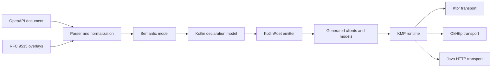

# Kotlin SDKGen

OpenAPI 3.1 SDK generation for Kotlin and Kotlin Multiplatform, with typed clients, portable runtime
transports, deterministic output, and compatibility tooling designed for long-lived APIs.

> [!IMPORTANT]
> Kotlin SDKGen is a **production-oriented preview**. It is exercised against large real-world API
> descriptions. Version [`0.4.0`](https://github.com/nabobery/kotlin-sdkgen/releases/tag/v0.4.0) is available
> from Maven Central, and the Gradle plugin is published
> on the Gradle Plugin Portal. Public APIs may change while the project remains in preview.

## Why Kotlin SDKGen?

SDK generation is easy when an API contains only flat JSON objects and ordinary request/response pairs.
The difficult parts are preserving wire semantics across composition, optionality, pagination, streaming,
multipart bodies, authentication, and future schema evolution—without leaking generator machinery into the
consumer's public API.

Kotlin SDKGen focuses on those boundaries:

- OpenAPI 3.1 ingestion, with an explicit normalization seam for supported OpenAPI 3.0 constructs.
- Typed Kotlin models and resource clients generated through KotlinPoet.
- Exact handling of `oneOf`, lossless multi-match `anyOf`, open enums, nullable/optional fields, and typed
  additional properties.
- Strict `allOf` intersections with fail-closed, audited resolution for contract-specific property conflicts.
- Media-specific request methods and explicit JSON, form, multipart, text, and binary wire encodings.
- Runtime support for authentication, retries, deadlines, pagination, server-sent events, multipart requests,
  middleware, and telemetry.
- Ktor, OkHttp, and Java HTTP transport adapters behind a shared transport contract.
- Deterministic generation, lock files, overlays, drift checks, API/ABI validation, and five-layer compatibility
  reports.
- Generated protocol glue kept internal so consumers see clients and models rather than codec infrastructure.

## Try it from source

You need Git and JDK 17. Clone the repository and validate the committed OpenRouter example:

```bash
git clone https://github.com/nabobery/kotlin-sdkgen.git
cd kotlin-sdkgen
./gradlew :generator:cli:run \
  --args='validate --config ../../conformance/openrouter/sdkgen.yaml'
```

Expected result:

```text
validate: ok diagnostics=23 exclusions=0
```

The relative path starts from `generator/cli`, which is the working directory of Gradle's `run` task.
The example is offline and uses the pinned source, overlay, and digests under
[`conformance/openrouter`](conformance/openrouter/).

Other CLI commands are available through the same entry point:

```bash
./gradlew :generator:cli:run --args='--help'
./gradlew :generator:cli:run \
  --args='generate --config ../../conformance/openrouter/sdkgen.yaml'
```

| Command    | Purpose                                                                 |
| ---------- | ----------------------------------------------------------------------- |
| `validate` | Parse, adapt, and validate without writing generated output.            |
| `generate` | Generate Kotlin sources and publication metadata.                       |
| `check`    | Confirm checked-in output still matches the effective inputs.           |
| `diff`     | Compare effective and generated contracts.                              |
| `explain`  | Trace a symbol or diagnostic back to its source.                        |
| `compat`   | Compare source, semantic-model, Kotlin-API, behavior, and ABI evidence. |

The versioned configuration and JSON CLI contracts are documented in
[`docs/cli-contract-v1alpha1.md`](docs/cli-contract-v1alpha1.md).

## Gradle integration

The cacheable Gradle plugin creates one generation task for each named SDK configuration and wires generated
sources into Kotlin/JVM or `commonMain` automatically:

```kotlin
plugins {
    kotlin("multiplatform") version "2.3.20"
    kotlin("plugin.serialization") version "2.3.20"
    id("io.github.nabobery.kotlin-sdkgen") version "0.4.0"
}

kotlin {
    jvm()
}

sdkgen {
    configurations {
        register("petstore") {
            configFile.set(layout.projectDirectory.file("sdkgen.yaml"))
        }
    }
}
```

The plugin declaration resolves from the Gradle Plugin Portal. In this repository, the same integration is
covered with composite-build TestKit fixtures.

Generated sources are attached to `main` (Kotlin/JVM) or `commonMain` (Kotlin Multiplatform) through a stable path
that the generation task builds, so Android Gradle Plugin consumers and configuration-cache builds need no ordering
shims. To attach the same sources to another source set, use the configuration's `generatedSources` collection:

```kotlin
kotlin.sourceSets.getByName("androidMain").kotlin.srcDir(sdkgen.configurations.getByName("petstore").generatedSources)
```

When the `org.jlleitschuh.gradle.ktlint` plugin is applied — before or after SDKGen — the plugin excludes every SDKGen
output root from linting through ktlint's supported filter API.

## Configuring generated clients

Every generated client keeps its original constructor and adds an overload that accepts a client-scoped
`SdkClientConfig` (retry and deadline defaults, request hook, middleware, lifecycle observers, a shared retry
budget, and the `User-Agent` product token). Per-call `CallOptions` keep final precedence:

```kotlin
val config =
    SdkClientConfig(
        retry = PolicyOverride.Replace(RetryDescriptor(maxAttempts = 2)),
        deadlines = SdkDeadlines(30_000, 10_000, null),
        productToken = "acme-app/1.2.3",
    )
val client = PetstoreClient(transport, "https://api.example.com", config)

client.pets.listPets()                                                // client retry + deadlines
client.pets.listPets(options = CallOptions(retry = PolicyOverride.Disabled)) // per-call override wins
```

Resource clients reached through one facade share that facade's configuration and retry budget. `runtime.defaultServer`
and `runtime.userAgentSuffix` in `sdkgen.yaml` provide the `baseUri` default and the default product token.

Contracts that describe a server-sent-event *envelope* (`{"event": …, "data": …}`) while the wire carries only the
payload in each `data:` field can select the payload with `x-sdkgen-streaming.payloadProperty`, in the document or
through an overlay:

```yaml
- target: "$['paths']['/chat/completions']['post']"
  update:
    x-sdkgen-streaming:
      mode: sse
      responseContentType: text/event-stream
      sentinel: "[DONE]"
      payloadProperty: data
```

The generated `Flow<T>` element type is then the payload model; omitting `payloadProperty` keeps the envelope type,
and a property that does not exist fails generation with an `UNREPRESENTABLE_OPERATION` diagnostic. See
[ADR 0022](docs/adr/0022-generated-client-configuration-and-sse-payloads.md).

## Architecture


```mermaid
flowchart LR
    Spec["OpenAPI document"] --> Intake["Parser and normalization"]
    Overlay["RFC 9535 overlays"] --> Intake
    Intake --> Model["Semantic model"]
    Model --> Declarations["Kotlin declaration model"]
    Declarations --> Emitter["KotlinPoet emitter"]
    Emitter --> SDK["Generated clients and models"]
    SDK --> Runtime["KMP runtime"]
    Runtime --> Ktor["Ktor transport"]
    Runtime --> OkHttp["OkHttp transport"]
    Runtime --> JavaHttp["Java HTTP transport"]
```

The semantic model is the central contract: parsing and overlays feed it, declaration projection consumes it,
and KotlinPoet emits source from the projected declarations. Generated output is published atomically so a failed
generation cannot leave a partially updated source tree.

## Kotlin targets

The KMP runtime and Ktor transport currently target:

- JVM and Android
- Kotlin/JS for Node.js and browsers
- iOS ARM64, iOS Simulator ARM64, and iOS x64
- macOS ARM64 and macOS x64
- Linux x64 and Linux ARM64
- mingw x64

The iOS x64 and macOS x64 (Intel) targets are cross-compiled and published; they are gated by compile/link
evidence rather than on-host test execution, as the Apple verification lane runs on an arm64 host.

Linux ARM64 and mingw x64 are compile-gate targets. Simulator tests require the corresponding Xcode runtime.
Wasm, watchOS, and tvOS are not currently supported. See [`runtime/README.md`](runtime/README.md) for the exact
test matrix and platform qualifications.

## Real-world conformance

The repository keeps generated snapshots and executable consumers for three independently shaped APIs:

| Corpus | What it demonstrates |
| --- | --- |
| [OpenRouter](conformance/openrouter/) | All 89 operations; strict schema intersections, request-media variants, SSE payload projection, client defaults, pagination, authentication, retries, and typed errors. |
| [GitHub REST](conformance/github/) | 7,189 generated Kotlin files and 119 accepted waivers; pagination, bearer authentication, PATCH presence semantics, typed errors, and unions. |
| [Stripe](conformance/stripe/) | 10,690 generated Kotlin files; 519 of 587 operations generated; form encoding, multipart arrays, Basic authentication, and typed responses. |

These corpora are conformance fixtures, not supported third-party SDK distributions. Their pinned inputs, overlays,
waivers, snapshots, and consumer tests make generator changes reviewable at realistic scale.

For a smaller tour, browse the generated
[`OpenRouter ChatClient`](conformance/openrouter/.snapshots/ed786b7bd85732deb25f659eb7d81576cb729ecb54e21b979f09806aa8685478/com/nabobery/sdkgen/generated/chat/ChatClient.kt)
or the [`Stripe client snapshot`](conformance/stripe/.snapshots/68c9ee6fdf1612aba97c79584c8483ca8432c81d29169f369f1ea7463b28b5ec/com/nabobery/sdkgen/generated/stripe/StripeClient.kt).

## Benchmark

The checked-in benchmark measures the complete generation pipeline against the GitHub REST corpus.

| Metric          |                       Result |
| --------------- | ---------------------------: |
| Samples         | 81.787 s, 82.060 s, 83.700 s |
| Median          |                 **82.060 s** |
| Enforced budget |                     96.000 s |

Environment: Linux amd64, JDK 17.0.19, one Gradle worker, and a 2 GiB heap. The records are stored in
[`generator/engine/benchmarks/records`](generator/engine/benchmarks/records/) and checked against
[`budget.json`](generator/engine/benchmarks/budget.json).

Benchmark results are host-bound. Compare changes using the same JVM, operating system, architecture, worker count,
and heap rather than treating this number as a cross-machine speed claim.

## Project status

Implemented and released through [`0.4.0`](https://github.com/nabobery/kotlin-sdkgen/releases/tag/v0.4.0):

- CLI, generation engine, KMP runtime, three transports, and cacheable Gradle integration.
- Corpus-scale generation, consumer compilation, compatibility reporting, ABI checks, and deterministic snapshots.
- Signed Maven publication with sources, Dokka documentation, POM metadata, checksums, SBOMs, and clean
  external-consumer resolution.
- Tag-bound release automation with credential-free verification and protected publication.
- Server-sent event streaming, offset/limit pagination, and Intel Apple publication variants for the portable
  runtime, testing library, and Ktor transport.
- Full 89-of-89 OpenRouter generation with zero blockers, strict `allOf` intersection algebra, audited conflict
  resolution, media-specific request variants, and explicit request-body wire encodings.
- Ten reclaimed GitHub webhook payload schemas (plus ten inline sub-schemas), reducing its accepted-waiver
  inventory from 139 to 119.
- Client-scoped retry and deadline defaults, request hooks, middleware, lifecycle observers, shared retry budgets,
  product identity, and generated default-server configuration with compatible generated-client constructors.
- Explicit SSE envelope payload projection for truthful stream element types, plus correct enum wire values and
  nullable-union branch matching.
- Android and custom KMP generated-source wiring that remains configuration-cache safe, with supported ktlint
  generated-source filtering.

The 0.3.0 schema-composition and request-media contracts are documented in the
[`OpenRouter corpus README`](conformance/openrouter/README.md) and
[ADR 0021](docs/adr/0021-schema-intersection-and-request-media-variants.md). See the
[`0.3.0 changelog`](CHANGELOG.md#030---2026-08-23) for the public API and wire-contract changes to consider when
upgrading. The
[`0.2.0`-to-`0.3.0` OpenRouter evidence packet](docs/conformance/evidence/releases/v0.2.0-to-v0.3.0/openrouter/)
records the release-bound corpus and emitted-API comparison, including the two compatibility layers that could not
be reconstructed after publication. Version 0.4.0 adds client-scoped configuration with compatible constructors,
explicit SSE payload projection, and Android/configuration-cache-safe Gradle wiring; see
[ADR 0022](docs/adr/0022-generated-client-configuration-and-sse-payloads.md), the
[`0.4.0` changelog](CHANGELOG.md#040---2026-08-30), and the
[`0.3.0`-to-`0.4.0` OpenRouter evidence packet](docs/conformance/evidence/releases/v0.3.0-to-v0.4.0/openrouter/).

See the [`documentation index`](docs/README.md), [`changelog`](CHANGELOG.md),
[`support policy`](docs/support-policy.md), and [`release runbook`](docs/release-runbook.md) for public contracts,
limitations, and maintainer procedures.

## Build and contribute

For a focused local check:

```bash
./gradlew check
./gradlew ktlintCheck
```

The complete target and corpus matrix needs Node.js, Chrome, the Android SDK, and platform-specific native
toolchains. The repository's [architecture decisions](docs/adr/) and [design decisions](docs/design-decisions.md)
explain the contracts that changes must preserve.

Bug reports, focused feature proposals, and pull requests are welcome. Please include a minimal OpenAPI fixture for
generator issues and a regression test whenever practical. See [`CONTRIBUTING.md`](CONTRIBUTING.md) and the
project's [`Code of Conduct`](CODE_OF_CONDUCT.md) before contributing.

For vulnerabilities, follow [`SECURITY.md`](SECURITY.md) and do not disclose sensitive details in a public issue.

## License

Kotlin SDKGen is licensed under the [Apache License 2.0](LICENSE).
