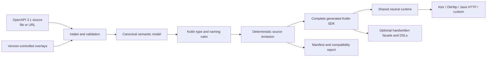
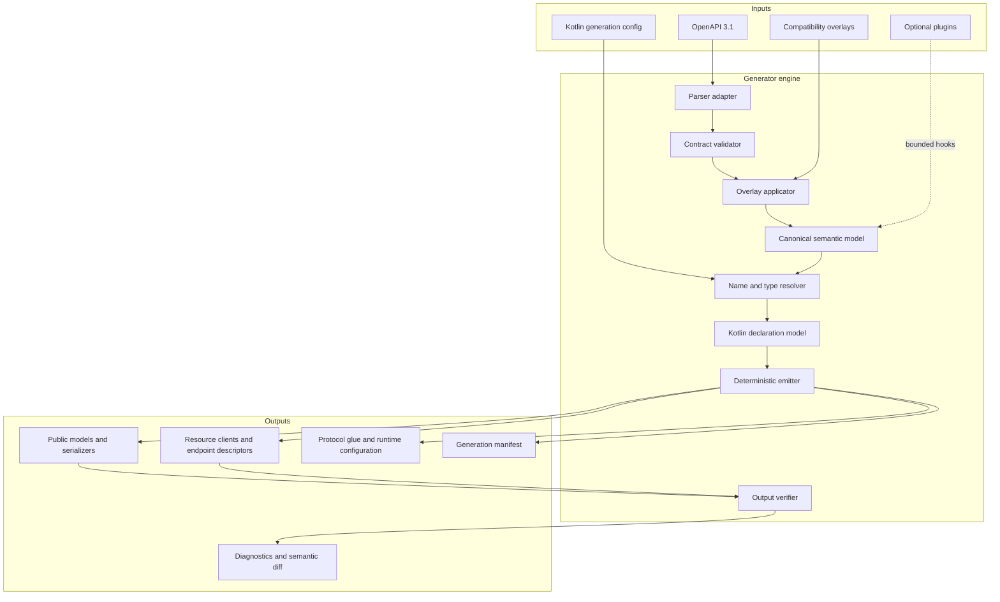
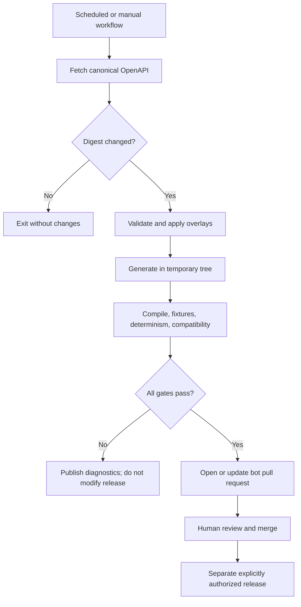

# Kotlin SDKGen: Product and Engineering Requirements

| Field            | Value                                                                                              |
| ---------------- | -------------------------------------------------------------------------------------------------- |
| Status           | Production-oriented preview; first public release pending                                  |
| Project          | Kotlin SDKGen                                                                                      |
| Repository       | [`nabobery/kotlin-sdkgen`](https://github.com/nabobery/kotlin-sdkgen)                              |
| Kotlin packages  | `com.nabobery.sdkgen`                                                                               |
| Publishing group | `io.github.nabobery`                                                                                |
| Initial consumer | [`nabobery/openrouter-kotlin`](https://github.com/nabobery/openrouter-kotlin)                      |
| Primary input    | OpenAPI 3.1 documents plus version-controlled overlays                                             |
| Primary output   | Complete deterministic Kotlin Multiplatform SDKs, shared runtime contracts, and transport adapters |
| Last updated     | 2026-08-13                                                                                         |

## 1. Executive summary

Kotlin SDKGen is an open-source OpenAPI 3.1 SDK generator for Kotlin and Kotlin Multiplatform. It turns an API description, explicit overlays, and versioned SDKGen configuration into a deterministic, compile-ready public SDK: immutable models, serializers, resource clients, typed errors, authentication, retries, pagination, streaming, multipart handling, and transport-neutral runtime integration.

The project is general-purpose by design. Its conformance suite uses OpenRouter, GitHub REST, and
Stripe specifications to exercise large schema graphs, mixed unions, nullable and optional fields,
open enums, free-form JSON, rapidly changing endpoints, and request-driven streaming. API-specific
behavior remains outside the generator core.

Kotlin SDKGen is not intended to reproduce Speakeasy's hosted control plane. Its goal is comparable generated SDK functionality through a trustworthy local and CI toolchain:

```text
OpenAPI source -> overlays/extensions -> semantic model -> complete Kotlin SDK -> conformance and compatibility reports
```

Generated code includes a stable public SDK surface over generated protocol glue and a thin shared runtime. Optional handwritten facades, extension functions, and domain DSLs compose with generated APIs without editing generated files. Runtime semantics are transport-neutral; Ktor, OkHttp, Java `HttpClient`, and custom transports integrate through adapters. Detailed semantic decisions are authoritative in [`design-decisions.md`](design-decisions.md).

## 2. Decision register

The distinction between a locked decision and a proposal is intentional. Validated proposals are
recorded below with their current status; they become compatibility commitments only when their
public contract is released.

### 2.1 Locked decisions

| ID      | Decision                                                                                                                                                                                                                                                                                                                                         |
| ------- | ------------------------------------------------------------------------------------------------------------------------------------------------------------------------------------------------------------------------------------------------------------------------------------------------------------------------------------------------ |
| DEC-001 | The repository and project are named `kotlin-sdkgen` and Kotlin SDKGen.                                                                                                                                                                                                                                                                          |
| DEC-002 | Packages use the `com.nabobery` namespace; published Maven coordinates use the `io.github.nabobery` group (amended 2026-08-14 for Maven Central namespace verification).                                                                                                                                                                                                                                                                             |
| DEC-003 | The generator is a separate product from `openrouter-kotlin`.                                                                                                                                                                                                                                                                                    |
| DEC-004 | The architecture is general-purpose; OpenRouter is the first conformance suite and scope driver.                                                                                                                                                                                                                                                 |
| DEC-005 | The pipeline is source, overlays, semantic model, Kotlin generation, and verification.                                                                                                                                                                                                                                                           |
| DEC-006 | Generate a complete public SDK plus optional composition-based handwritten facades and extensions; never rely on editable generated regions.                                                                                                                                                                                                     |
| DEC-007 | Generation must be deterministic, and generated sources may be committed and verified in CI.                                                                                                                                                                                                                                                     |
| DEC-008 | Spec automation may open or update tested pull requests but must never auto-merge or auto-publish.                                                                                                                                                                                                                                               |
| DEC-009 | Common generated code must not contain `Any`, JVM-only types, or a hard-coded platform engine.                                                                                                                                                                                                                                                   |
| DEC-010 | Foundation Evaluation bake-off is complete. The selected parser, semantic-model, overlay, emitter, runtime, ABI, packaging, Gradle, union, and open-enum foundations are recorded in [`docs/adr/`](adr/), beginning with [ADR 0001](adr/0001-parser-swagger-parser-behind-seam.md).                                                                            |
| DEC-011 | Use a thin shared KMP runtime, generated protocol glue, a small stable public SPI, and transport adapters for Ktor, OkHttp, Java `HttpClient`, and custom transports.                                                                                                                                                                            |
| DEC-012 | Public async APIs use `suspend` and cold `Flow`; optional JVM interop supplies futures and Java publishers.                                                                                                                                                                                                                                      |
| DEC-013 | `sdkgen.yaml` and `sdkgen.lock` are versioned, schema-validated, strict, and migratable; standard OpenAPI Overlays carry contract corrections.                                                                                                                                                                                                   |
| DEC-014 | Runtime behavior is metadata-driven, including typed errors, retries, idempotency, pagination, streaming, multipart, authentication, timeouts, and observability.                                                                                                                                                                                |
| DEC-015 | Serialization uses `kotlinx.serialization` behind an immutable client-scoped media-type codec registry and preserves open enums, unknown extensible fields, and three-state presence.                                                                                                                                                            |
| DEC-016 | Composed schemas use adaptive typed representations. Closed `oneOf` uses sealed cases, declared discriminator dispatch or unique structural matching, and strict ambiguity errors. Multi-match `anyOf` remains valid and uses the raw-preserving wrapper with lazy typed views selected in [ADR 0003](adr/0003-anyof-raw-preserving-wrapper.md). |
| DEC-017 | The initial Kotlin baseline is 2.3.20; portable format mappings avoid Kotlin 2.4-only and JVM-only public types.                                                                                                                                                                                                                                 |
| DEC-018 | Plugins use experimental typed phases over immutable IR; arbitrary templates and post-emission rewriting are excluded from 1.0.                                                                                                                                                                                                                  |
| DEC-019 | OpenRouter, GitHub REST, and Stripe are the required real-world conformance corpora before 1.0.                                                                                                                                                                                                                                                  |
| DEC-020 | OpenAPI, semantic IR, generated Kotlin API, runtime behavior, and published ABI are independently gated.                                                                                                                                                                                                                                         |

### 2.2 Validated proposals and future candidates

| ID       | Proposal                                                                                                           | Status / validation                                                                                                                                                                                                                                             |
| -------- | ------------------------------------------------------------------------------------------------------------------ | --------------------------------------------------------------------------------------------------------------------------------------------------------------------------------------------------------------------------------------------------------------- |
| PROP-001 | Ship a JVM CLI plus a Gradle plugin backed by the same generator library.                                          | **Accepted with conditions.** Preserve the twelve engine cacheability constraints and add production TestKit coverage; see [ADR 0009](adr/0009-gradle-plugin-direction.md).                                                                                     |
| PROP-002 | Use KotlinPoet only as the final source-emission layer.                                                            | **Accepted with conditions.** Keep the `CodeBlock` escape hatch narrow and generator-owned, with compile/golden coverage; see [ADR 0004](adr/0004-emitter-kotlinpoet.md).                                                                                       |
| PROP-003 | Parse OpenAPI into a generator-owned immutable semantic model.                                                     | **Accepted with conditions.** Use swagger-parser only behind the seam, retain source/provenance, and complete required JSON Schema coverage; see [ADR 0001](adr/0001-parser-swagger-parser-behind-seam.md) and [ADR 0002](adr/0002-semantic-model-strategy.md). |
| PROP-004 | Implement standard OpenAPI Overlays plus canonical `x-sdkgen-*` extension schemas.                                 | **Accepted.** Overlay `copy` and the pinned RFC 9535 conformance suite are implemented; see [ADR 0005](adr/0005-overlays-owned-applicator-jsonpath-seam.md).                                                                                           |
| PROP-005 | Implement the locked transport-neutral runtime and adapter split.                                                  | **Accepted.** Ordinary JSON, incremental SSE, and multipart behavior are covered by the transport contract kit; see [ADR 0006](adr/0006-runtime-spi.md).                                                                                                |
| PROP-006 | Publish independently useful generator, runtime, adapter, CLI, and Gradle artifacts.                               | **Accepted with conditions.** Publish eight coordinates on one version train, with model and OpenAPI intake internal to the engine until independent consumers exist; see [ADR 0008](adr/0008-artifact-split-8-coordinates.md).                                 |
| PROP-007 | Generate typed webhook event unions and signature-verification helpers from contract metadata.                     | Validate demand and a canonical `x-sdkgen-webhooks` schema against the conformance corpora; competitive parity feature (Speakeasy, Fern, and Stainless all ship it).                                                                                            |
| PROP-008 | Generate a README and per-operation usage snippets from the contract and its examples.                             | Validate template quality on generated OpenRouter output before committing to the 1.0 surface.                                                                                                                                                                  |
| PROP-009 | Ship an optional OAuth2 client-credentials provider artifact (token acquisition, caching, refresh).                | Validate against the locked provider SPI; core still excludes browser/session flows.                                                                                                                                                                            |
| PROP-010 | Adopt generator editions that pin intentional default changes which would otherwise rewrite generated public APIs. | Validate the edition/manifest interaction during Foundation Evaluation and Generator Alpha; the technical specification describes the mechanism.                                                                                                                                                |

## 3. Product boundary



### 3.1 Generator responsibilities

- Resolve and validate OpenAPI 3.1 documents.
- Apply reviewable overlays in deterministic order.
- Preserve distinctions the Kotlin type system needs, especially missing versus explicit `null`.
- Interpret schema composition and references into a safe semantic model.
- Resolve stable Kotlin names and types.
- Generate immutable public models, request builders/DSLs, serializers, resource clients, endpoint descriptors, and typed errors.
- Generate and configure transport-neutral authentication, retry, pagination, streaming, multipart, timeout, telemetry, and lifecycle behavior.
- Publish a thin common runtime and adapters without embedding a platform engine in generated common code.
- Produce source manifests, diagnostics, and semantic diffs.
- Support reproducible local generation and CI verification.
- Provide extension points without allowing plugins to silently corrupt the contract.

### 3.2 Consumer and handwritten-extension responsibilities

- Select and configure a transport adapter and concrete platform engine.
- Supply credentials, trusted hosts, application telemetry integrations, and client policy overrides.
- Add optional domain-specific facades, validation, orchestration, and DSL extensions by composition.
- Provide product behavior that cannot be derived from the effective API contract.
- Maintain API-specific behavioral fixtures and explicitly documented deviations from official SDKs.

## 4. Problem statement

Existing Kotlin OpenAPI generators do not reliably produce portable, idiomatic, compile-ready output from complex OpenAPI 3.1 documents. Common failures include:

- Treating optional and nullable as equivalent.
- Emitting `Any` for free-form or composed schemas, which is unsafe for multiplatform serialization.
- Incomplete or invalid `oneOf`, `anyOf`, and `allOf` modeling.
- Generating JVM imports or engines into `commonMain`.
- Exposing unstable generated types directly as the public SDK contract.
- Losing unknown enum or union variants when an API evolves.
- Treating streaming endpoints as ordinary buffered responses.
- Producing non-deterministic output that is hard to review.
- Lacking a semantic drift report when a remote contract changes.

OpenRouter's current official SDKs demonstrate that production SDK generation is not a raw specification-to-source transformation. Their Speakeasy workflows apply reviewed overlays and language-specific generation configuration before emitting TypeScript, Python, and Go SDKs. Kotlin SDKGen must provide an equivalent auditable boundary for Kotlin without depending on a hosted proprietary generation service or restricting output to JVM.

## 5. Vision, goals, and non-goals

### 5.1 Vision

Make OpenAPI 3.1 a dependable source for complete, idiomatic Kotlin SDKs across JVM, Android, Apple, JavaScript, Linux, Windows, and future conformant Kotlin Multiplatform targets.

### 5.2 Goals

| ID    | Goal                                                                                                                            |
| ----- | ------------------------------------------------------------------------------------------------------------------------------- |
| G-001 | Generate compile-ready common Kotlin from complex production OpenAPI 3.1 contracts.                                             |
| G-002 | Preserve wire compatibility and OpenAPI semantics while generating an idiomatic, stable, configurable public API.               |
| G-003 | Keep generated output portable across an actively maintained KMP target-family matrix.                                          |
| G-004 | Make upstream drift visible, reviewable, reproducible, and safe to adopt.                                                       |
| G-005 | Support extension through overlays and bounded plugins without forking templates for every API.                                 |
| G-006 | Make OpenRouter a stringent end-to-end conformance suite, not a special case in the core.                                       |
| G-007 | Enable SDK authors to extend generated public APIs through wrappers, decorators, extension functions, and optional DSL modules. |
| G-008 | Provide actionable diagnostics for unsupported or ambiguous schema constructs.                                                  |

### 5.3 Non-goals for 1.0

- A hosted control plane, web dashboard, schema registry, or managed generation service.
- Generation for languages other than Kotlin.
- Product-specific orchestration, agent loops, or business-domain APIs not described by the effective contract.
- Agent frameworks, tool-execution loops, or OpenRouter orchestration.
- Automatic publishing to Maven Central.
- Automatic merge of spec-update pull requests.
- Generating application UI, database layers, servers, Terraform providers, or MCP servers.
- Supporting every historical Kotlin target preset regardless of maintenance status.
- Hiding invalid or unsupported schemas behind `Any` or silent fallbacks.
- Guaranteeing compatibility across an upstream breaking change without a generated compatibility report and explicit migration.

## 6. Users and use cases

### 6.1 Personas

| Persona               | Need                                                                   | Primary success condition                                                   |
| --------------------- | ---------------------------------------------------------------------- | --------------------------------------------------------------------------- |
| Kotlin SDK maintainer | Track a fast-moving API without hand-copying hundreds of wire types.   | A reviewed spec change regenerates cleanly and keeps the public SDK stable. |
| KMP library author    | Share contracts and endpoint metadata across multiple target families. | `commonMain` compiles without platform leakage.                             |
| API platform team     | Offer a Kotlin SDK from an existing OpenAPI 3.1 contract.              | CI detects contract drift and produces an understandable update.            |
| Contributor           | Understand why a schema generated a particular Kotlin declaration.     | Diagnostics identify source pointers, overlays, and applied rules.          |
| Release engineer      | Reproduce checked-in generated sources and audit changes.              | The same inputs and tool version produce a zero diff.                       |

### 6.2 Representative use cases

1. A maintainer pins an OpenAPI document and generates a complete publishable Kotlin SDK.
2. An API uses an open string enum; generated Kotlin preserves known constants and unknown server values.
3. An object property is optional but non-null when present; generated serialization distinguishes it from nullable.
4. A mixed `oneOf` includes references, inline objects, primitives, and `null`; the generator emits adaptive sealed cases and rejects an ambiguous payload unless explicit contract metadata resolves it.
5. A scheduled workflow detects a new upstream specification, generates into a temporary directory, runs conformance tests, and opens a review pull request.
6. An API-specific overlay corrects a documented contract defect without editing the upstream file or generated sources.
7. OpenRouter chat operations expose generated immutable requests, Kotlin DSL construction, typed provider options, and incremental `Flow<ChatStreamEvent>` streaming; a handwritten facade may add orchestration by composition.

## 7. Functional requirements

Priority meanings: **P0** blocks the first usable release, **P1** is required for 1.0, and **P2** is valuable follow-up work.

### 7.1 Specification intake and validation

| ID          | Priority | Requirement                                                                                                                                       |
| ----------- | -------- | ------------------------------------------------------------------------------------------------------------------------------------------------- |
| FR-SPEC-001 | P0       | Accept an OpenAPI 3.1 document from a local file.                                                                                                 |
| FR-SPEC-002 | P1       | Accept a document from an HTTPS URL with explicit caching and checksum behavior.                                                                  |
| FR-SPEC-003 | P0       | Resolve local and remote `$ref` values without losing source locations.                                                                           |
| FR-SPEC-004 | P0       | Validate structure before generation and fail with JSON Pointer or YAML-path diagnostics.                                                         |
| FR-SPEC-005 | P0       | Record the canonical source digest and generator version in a manifest.                                                                           |
| FR-SPEC-006 | P0       | Reject ambiguous unsupported constructs unless a declared policy or overlay resolves them.                                                        |
| FR-SPEC-007 | P1       | Preserve vendor extensions in the semantic model for plugins and reports.                                                                         |
| FR-SPEC-008 | P1       | Permit an allowlist of warnings to support gradual adoption without hiding new warnings.                                                          |
| FR-SPEC-009 | P2       | Compose multiple source documents into one effective root before overlays, with conflict-by-default semantics as defined in the design decisions. |

### 7.2 Overlays and normalization

| ID         | Priority | Requirement                                                                                                                                                                                                 |
| ---------- | -------- | ----------------------------------------------------------------------------------------------------------------------------------------------------------------------------------------------------------- |
| FR-OVR-001 | P0       | Apply multiple version-controlled overlays in a declared, deterministic order.                                                                                                                              |
| FR-OVR-002 | P0       | Validate every overlay operation and fail when its target no longer exists. This is a deliberately stricter, SDKGen-owned policy: the OpenAPI Overlay Specification defines a zero-match action as success. |
| FR-OVR-003 | P0       | Include overlay identity and digest in the generation manifest.                                                                                                                                             |
| FR-OVR-004 | P0       | Report the effective contract diff produced by overlays.                                                                                                                                                    |
| FR-OVR-005 | P1       | Support standard OpenAPI Overlay documents where their semantics are sufficient.                                                                                                                            |
| FR-OVR-006 | P1       | Support canonical focused `x-sdkgen-*` extensions and presentation/runtime configuration without modifying upstream contract facts.                                                                         |
| FR-OVR-007 | P0       | Distinguish a factual compatibility correction from a Kotlin presentation rule.                                                                                                                             |
| FR-OVR-008 | P1       | Detect conflicting overlay operations and require an explicit resolution policy.                                                                                                                            |

Foundation Evaluation proved ordered `update` and `remove` application. Overlay 1.1 `copy` and demonstrated full RFC 9535 JSONPath conformance remain mandatory Generator Alpha gates; support MUST NOT be described as complete Overlay 1.1 support until both pass. See [ADR 0005](adr/0005-overlays-owned-applicator-jsonpath-seam.md).

Overlay categories should remain separate:

```yaml
# Proposal: sdkgen.yaml
schemaVersion: v1alpha1

source:
    file: openapi/openapi.yaml
    sha256: "..."

overlays:
    - openapi/overlays/compatibility.yaml
    - openapi/overlays/open-enums.yaml

kotlin:
    package: com.example.generated
    visibility: public
    namePrefix: null
    unknownEnums: preserve
    optionality: explicit
    output: src/commonMain/kotlin

runtime:
    transports: [ktor, okhttp, java-http]
    retries: metadata-driven
```

The exact field names remain subject to Foundation Evaluation validation, but the versioned YAML/JSON document, strict JSON Schema validation, migrations, and companion `sdkgen.lock` are locked requirements.

### 7.3 Semantic model

| ID         | Priority | Requirement                                                                                                                                                                                                  |
| ---------- | -------- | ------------------------------------------------------------------------------------------------------------------------------------------------------------------------------------------------------------ |
| FR-MOD-001 | P0       | Represent schemas independently of any particular parser library or source emitter.                                                                                                                          |
| FR-MOD-002 | P0       | Retain original source locations, stable schema identities, descriptions, deprecations, formats, constraints, examples, defaults, and extensions.                                                            |
| FR-MOD-003 | P0       | Model requiredness and nullability as separate dimensions.                                                                                                                                                   |
| FR-MOD-004 | P0       | Normalize nullability from both OpenAPI 3.0-style `nullable: true` and OpenAPI 3.1/JSON Schema explicit `null` alternatives without erasing the original syntax or conflating nullability with requiredness. |
| FR-MOD-005 | P0       | Represent reference-only, inline, primitive, array, object, and mixed `oneOf`/`anyOf` branches.                                                                                                              |
| FR-MOD-006 | P0       | Represent `allOf` composition without losing validation constraints or property ownership.                                                                                                                   |
| FR-MOD-007 | P0       | Represent discriminator mappings, including incomplete or conflicting mappings.                                                                                                                              |
| FR-MOD-008 | P0       | Represent open and closed objects, typed additional properties, and free-form JSON.                                                                                                                          |
| FR-MOD-009 | P0       | Represent open and closed enums, including unknown-value strategy.                                                                                                                                           |
| FR-MOD-010 | P1       | Model parameters by location, serialization style, explode behavior, and content type.                                                                                                                       |
| FR-MOD-011 | P1       | Model request and response content alternatives, streaming media types, binary bodies, multipart parts, headers, links, and callbacks without dropping data.                                                 |
| FR-MOD-012 | P0       | Detect recursive graphs without infinite resolution or unstable names.                                                                                                                                       |
| FR-MOD-013 | P1       | Expose a documented immutable, phase-specific experimental plugin API over generator-owned semantic and declaration models.                                                                                  |

### 7.4 Kotlin type system and source generation

| ID         | Priority | Requirement                                                                                                                                                                                                                                                                                                                                                                                                                                                                                                                  |
| ---------- | -------- | ---------------------------------------------------------------------------------------------------------------------------------------------------------------------------------------------------------------------------------------------------------------------------------------------------------------------------------------------------------------------------------------------------------------------------------------------------------------------------------------------------------------------------- |
| FR-KOT-001 | P0       | Generate immutable Kotlin declarations compatible with `kotlinx.serialization`.                                                                                                                                                                                                                                                                                                                                                                                                                                              |
| FR-KOT-002 | P0       | Never emit `Any` or `Any?` as a fallback in generated wire contracts.                                                                                                                                                                                                                                                                                                                                                                                                                                                        |
| FR-KOT-003 | P0       | Use `JsonElement`, `JsonObject`, or a typed map for genuinely free-form JSON.                                                                                                                                                                                                                                                                                                                                                                                                                                                |
| FR-KOT-004 | P0       | Never emit `java.*`, `javax.*`, JVM-only annotations, or platform engines in common output.                                                                                                                                                                                                                                                                                                                                                                                                                                  |
| FR-KOT-005 | P0       | Emit stable, deterministic declarations independent of filesystem traversal order or host operating system.                                                                                                                                                                                                                                                                                                                                                                                                                  |
| FR-KOT-006 | P0       | Preserve exact wire names through serialization annotations.                                                                                                                                                                                                                                                                                                                                                                                                                                                                 |
| FR-KOT-007 | P0       | Generate collision-safe Kotlin names for schemas, operations, properties, enum entries, and reserved words.                                                                                                                                                                                                                                                                                                                                                                                                                  |
| FR-KOT-008 | P0       | Provide a forward-compatible open-enum representation that round-trips unknown values.                                                                                                                                                                                                                                                                                                                                                                                                                                       |
| FR-KOT-009 | P0       | Generate an adaptive typed representation for composed schemas. Closed `oneOf` schemas use sealed cases with discriminator dispatch or structural matching and exact serializers. Foundation Evaluation selects the public representation for multi-match `anyOf` without assuming that every `anyOf` is an exclusive union.                                                                                                                                                                                                               |
| FR-KOT-010 | P0       | For non-discriminated `oneOf`, fail on zero or multiple structural matches unless explicit contract metadata resolves the ambiguity; never use document-order first match. For non-discriminated `anyOf`, zero matches fail and multiple matches remain valid. The representation MUST preserve lossless JSON value identity with stable key-order re-emission and the semantics of every successful branch; a preferred typed projection MAY be deterministic but MUST NOT silently discard information from other matches. |
| FR-KOT-011 | P0       | Preserve optional-versus-present-null semantics through an explicit field-state strategy where required.                                                                                                                                                                                                                                                                                                                                                                                                                     |
| FR-KOT-012 | P0       | Under the Kotlin 2.3.20 baseline, map instants and durations to `kotlin.time`, civil date/time to `kotlinx.datetime`, UUID/URI/decimal to SDK-owned portable value types, and binary to `ByteArray` or `SdkByteStream`; keep mappings configurable.                                                                                                                                                                                                                                                                          |
| FR-KOT-013 | P1       | Generate KDoc with source descriptions, deprecation markers, constraints, and source pointers where useful.                                                                                                                                                                                                                                                                                                                                                                                                                  |
| FR-KOT-014 | P0       | Generate a public SDK surface and keep generated protocol glue internal.                                                                                                                                                                                                                                                                                                                                                                                                                                                     |
| FR-KOT-015 | P1       | Support optional explicit type and member prefixes without automatic collision renaming.                                                                                                                                                                                                                                                                                                                                                                                                                                     |
| FR-KOT-016 | P1       | Generate code into a disposable directory or source set that is never manually edited.                                                                                                                                                                                                                                                                                                                                                                                                                                       |
| FR-KOT-017 | P0       | Generate immutable canonical request objects, Kotlin DSL builders over those objects, and Java-friendly builders.                                                                                                                                                                                                                                                                                                                                                                                                            |
| FR-KOT-018 | P0       | Group resources by tags with deterministic overrides, share implementation for multi-tag operations, and keep untagged operations at the client root.                                                                                                                                                                                                                                                                                                                                                                        |
| FR-KOT-019 | P0       | Generate body-first ordinary methods plus mirrored `withResponse()` methods exposing status, headers, and request metadata.                                                                                                                                                                                                                                                                                                                                                                                                  |

Selected open-enum shape:

```kotlin
@Serializable(with = ProviderSort.Serializer::class)
sealed class ProviderSort(open val value: String) {
    data object Price : ProviderSort("price")
    data object Throughput : ProviderSort("throughput")
    data object Latency : ProviderSort("latency")
    data class SdkUnknown(override val value: String) : ProviderSort(value)

    companion object {
        fun fromValue(value: String): ProviderSort = when (value) {
            "price" -> Price
            "throughput" -> Throughput
            "latency" -> Latency
            else -> SdkUnknown(value)
        }
    }

    object Serializer : KSerializer<ProviderSort> {
        // Generated portable string serializer.
    }
}
```

This AWS-style sealed vehicle preserves the locked unknown-value semantics and avoids value-class mangling in Java-visible constructors, properties, and method signatures; see [ADR 0010](adr/0010-open-enum-sealed-hierarchy.md). If a remaining common implementation type uses `@JvmInline`, its source must include `import kotlin.jvm.JvmInline`; despite the package name, that annotation is common-compatible in the pinned toolchain.

### 7.5 Generated SDK and transport-neutral runtime

| ID         | Priority | Requirement                                                                                                                                                                                                                                                                                                                                                                                                                                                  |
| ---------- | -------- | ------------------------------------------------------------------------------------------------------------------------------------------------------------------------------------------------------------------------------------------------------------------------------------------------------------------------------------------------------------------------------------------------------------------------------------------------------------ |
| FR-END-001 | P0       | Generate transport-neutral operation descriptors for HTTP metadata, serialization, security, safety, replayability, retries, pagination, streaming, and errors.                                                                                                                                                                                                                                                                                              |
| FR-END-002 | P0       | Generated descriptors and public APIs compile in common code without a concrete HTTP engine.                                                                                                                                                                                                                                                                                                                                                                 |
| FR-END-003 | P0       | Publish adapters for Ktor, OkHttp, and Java `HttpClient`, plus a documented custom-transport SPI and reference fake transport.                                                                                                                                                                                                                                                                                                                               |
| FR-END-004 | P0       | Preserve response status and media-type alternatives while ordinary methods return decoded bodies and `withResponse()` exposes metadata.                                                                                                                                                                                                                                                                                                                     |
| FR-END-005 | P0       | Expose `suspend` operations and cold `Flow` pagination/streaming APIs with structured cancellation.                                                                                                                                                                                                                                                                                                                                                          |
| FR-END-006 | P0       | Generate typed exceptions and runtime policies for authentication, retries, idempotency, timeouts, pagination, streaming, multipart, telemetry, redaction, and client lifecycle.                                                                                                                                                                                                                                                                             |
| FR-END-007 | P0       | Encode multipart in the neutral runtime with typed parts, OpenAPI encoding metadata, incremental streaming, and compositional replayability.                                                                                                                                                                                                                                                                                                                 |
| FR-END-008 | P0       | Support explicit request-driven streaming metadata through canonical `x-sdkgen-streaming` extensions or overlays.                                                                                                                                                                                                                                                                                                                                            |
| FR-END-009 | P0       | Represent neutral byte bodies with a suspending pull-based `SdkByteStream`; adapters bridge platform stream types.                                                                                                                                                                                                                                                                                                                                           |
| FR-END-010 | P0       | Distinguish replayable and one-shot request bodies and permit bounded opt-in spooling without hidden unbounded buffering.                                                                                                                                                                                                                                                                                                                                    |
| FR-END-011 | P0       | Implement metadata-driven bounded retries with full jitter, retry quota, `Retry-After`, operation safety, body replayability, and attempt history.                                                                                                                                                                                                                                                                                                           |
| FR-END-012 | P0       | Generate idempotency keys only from explicit contract metadata, once per logical call, and reuse them across attempts; caller values win.                                                                                                                                                                                                                                                                                                                    |
| FR-END-013 | P0       | Generate first-page, `Flow<Page<T>>`, and `Flow<T>` pagination from explicit typed pagination metadata without hidden prefetch.                                                                                                                                                                                                                                                                                                                              |
| FR-END-014 | P0       | Enforce same-origin next URLs by default, trusted-host cross-origin policy, loop detection, and optional page/item/time bounds.                                                                                                                                                                                                                                                                                                                              |
| FR-END-015 | P0       | Separate pre-emission retries from explicitly resumable SSE reconnection using event IDs and bounded policy.                                                                                                                                                                                                                                                                                                                                                 |
| FR-END-016 | P0       | Decode SSE, JSONL, and declared streaming protocols incrementally, classify fatal in-band errors explicitly, and expose detailed event metadata through a mirrored projection.                                                                                                                                                                                                                                                                               |
| FR-END-017 | P0       | Implement total-call, per-attempt, stream-idle, upload-idle, and pagination-budget timeouts in portable core semantics with adapter capability checks.                                                                                                                                                                                                                                                                                                       |
| FR-END-018 | P0       | Generate OpenAPI security AND/OR semantics and suspending host-scoped credential providers; keep OAuth browser/session flows in optional integrations.                                                                                                                                                                                                                                                                                                       |
| FR-END-019 | P0       | Dispatch JSON and other media types through an immutable client-scoped codec registry; concrete transports only exchange metadata and bytes.                                                                                                                                                                                                                                                                                                                 |
| FR-END-020 | P0       | Accept one typed `CallOptions` aggregate with explicit inherit, disable, and replace semantics for per-call policy.                                                                                                                                                                                                                                                                                                                                          |
| FR-END-021 | P1       | Expose logical-call middleware once, attempt middleware per physical request, and a separate read-only lifecycle observer with deterministic ordering.                                                                                                                                                                                                                                                                                                       |
| FR-END-022 | P1       | Expose transport-neutral upload/download progress through `CallOptions`, with attempt-aware counters and optional callback/Flow bridges.                                                                                                                                                                                                                                                                                                                     |
| FR-END-023 | P1       | Keep telemetry neutral in core and provide optional OpenTelemetry, Micrometer, and SLF4J JVM integrations with deny-by-default redaction.                                                                                                                                                                                                                                                                                                                    |
| FR-END-024 | P0       | Provide a capability-aware SDK-identification policy containing the generated SDK name/version, generator version, and platform. Adapters that can control `User-Agent` SHOULD send it in the reserved post-middleware stage. Browser adapters MUST tolerate user-agent control being unavailable and MAY use an explicitly configured companion header when the server's CORS policy permits it; inability to send either header MUST NOT fail the request. |
| FR-END-025 | P1       | Expose typed rate-limit metadata (limit, remaining, reset) parsed from standard and configured response headers through `withResponse()` and lifecycle events, reusing the retry engine's header-parsing machinery.                                                                                                                                                                                                                                          |

### 7.6 CLI

| ID         | Priority | Requirement                                                                                                                      |
| ---------- | -------- | -------------------------------------------------------------------------------------------------------------------------------- |
| FR-CLI-001 | P0       | `generate` produces sources and a manifest from a configuration file.                                                            |
| FR-CLI-002 | P0       | `validate` validates the source, overlays, and configuration without writing generated Kotlin.                                   |
| FR-CLI-003 | P0       | `check` generates in isolation and fails when committed output differs.                                                          |
| FR-CLI-004 | P1       | `diff` reports semantic contract changes and predicted Kotlin API impact.                                                        |
| FR-CLI-005 | P1       | `explain` identifies why a source node maps to a Kotlin declaration or diagnostic.                                               |
| FR-CLI-006 | P0       | Support machine-readable JSON diagnostics in addition to human-readable output.                                                  |
| FR-CLI-007 | P0       | Use non-zero exit codes for invalid input, generation failure, drift, and compatibility failure, with distinct codes documented. |
| FR-CLI-008 | P0       | Never fetch an unpinned remote source during a release build unless explicitly configured.                                       |
| FR-CLI-009 | P1       | `migrate` upgrades a supported configuration or lock format and produces a reviewable diff.                                      |

Proposed CLI:

```shell
kotlin-sdkgen validate --config sdkgen.yaml
kotlin-sdkgen generate --config sdkgen.yaml
kotlin-sdkgen check --config sdkgen.yaml
kotlin-sdkgen diff --from manifest-old.json --to manifest-new.json
kotlin-sdkgen explain --config sdkgen.yaml --pointer '#/components/schemas/ProviderOptions'
```

### 7.7 Gradle plugin

| ID         | Priority | Requirement                                                                                            |
| ---------- | -------- | ------------------------------------------------------------------------------------------------------ |
| FR-GRD-001 | P1       | Publish a Gradle plugin using an `io.github.nabobery` plugin ID.                                       |
| FR-GRD-002 | P1       | Register cacheable generation and verification tasks with declared inputs and outputs.                 |
| FR-GRD-003 | P1       | Integrate generated directories with Kotlin Multiplatform source sets without assuming target presets. |
| FR-GRD-004 | P1       | Support Gradle configuration cache and build cache.                                                    |
| FR-GRD-005 | P1       | Avoid network access during ordinary compilation when pinned sources are available locally.            |
| FR-GRD-006 | P1       | Run the exact same generator engine as the CLI.                                                        |
| FR-GRD-007 | P1       | Permit multiple named generation configurations in one build.                                          |

Proposed Gradle DSL:

```kotlin
plugins {
    id("io.github.nabobery.kotlin-sdkgen") version "0.x.y"
}

kotlinSdkGen {
    specs.register("openrouter") {
        source.set(layout.projectDirectory.file("openapi/openapi.yaml"))
        overlays.from(layout.projectDirectory.files("openapi/overlays"))
        packageName.set("com.nabobery.openrouter")
        outputDirectory.set(layout.projectDirectory.dir("generated/commonMain/kotlin"))
        visibility.set(GeneratedVisibility.Public)
    }
}
```

### 7.8 Plugins and extension model

| ID         | Priority | Requirement                                                                                                                                                                                                 |
| ---------- | -------- | ----------------------------------------------------------------------------------------------------------------------------------------------------------------------------------------------------------- |
| FR-PLG-001 | P1       | Separate contract correction through overlays from code-generation customization through plugins.                                                                                                           |
| FR-PLG-002 | P1       | Define ordered extension phases with immutable inputs and validated outputs.                                                                                                                                |
| FR-PLG-003 | P1       | Require plugin identity, version, compatible SDKGen SPI range, configuration digest, order, and phases in the manifest.                                                                                     |
| FR-PLG-004 | P1       | Expose no network or arbitrary filesystem capability through the plugin API; document that in-process third-party plugins remain trusted build-time code and cannot be securely sandboxed by the generator. |
| FR-PLG-005 | P1       | Provide diagnostics when multiple plugins make conflicting name or type decisions.                                                                                                                          |
| FR-PLG-006 | P2       | Offer a service-provider loading mechanism for third-party JVM plugins.                                                                                                                                     |
| FR-PLG-007 | P1       | Keep the core useful without third-party plugins.                                                                                                                                                           |
| FR-PLG-008 | P1       | Keep the plugin SPI experimental through `0.x`, validate every transformed value, and publish migration notes for breaks.                                                                                   |
| FR-PLG-009 | P1       | Do not support arbitrary templates or post-emission text rewriting in 1.0.                                                                                                                                  |
| FR-PLG-010 | P2       | Use isolated execution classpaths where practical while documenting that JVM plugins remain trusted code, not sandboxed code.                                                                               |

Proposed extension phases:

1. Effective-contract validation and normalization.
2. Semantic-model validation and immutable transformation.
3. Kotlin naming and type mapping.
4. Declaration augmentation.
5. Output verification.

Plugins must not mutate already emitted source text. They should transform typed specifications so formatting and determinism remain centralized.

### 7.9 Manifests and compatibility reports

| ID         | Priority | Requirement                                                                                                                                                      |
| ---------- | -------- | ---------------------------------------------------------------------------------------------------------------------------------------------------------------- |
| FR-RPT-001 | P0       | Emit a manifest containing source digest, overlay digests, configuration digest, generator version, plugin versions, generated files, and semantic-model digest. |
| FR-RPT-002 | P0       | Exclude timestamps and host-specific absolute paths from deterministic output.                                                                                   |
| FR-RPT-003 | P1       | Classify endpoint and schema changes as additive, behaviorally risky, or breaking.                                                                               |
| FR-RPT-004 | P1       | Report generated Kotlin additions, removals, renames, nullability changes, and type changes.                                                                     |
| FR-RPT-005 | P1       | Make reports readable in terminals and attachable to pull requests as Markdown or JSON.                                                                          |
| FR-RPT-006 | P1       | Link each reported Kotlin change to its OpenAPI source pointer and applicable overlay.                                                                           |

## 8. Non-functional requirements

### 8.1 Portability

| ID           | Requirement                                                                                                                                                                                                                                                                                                                                                               |
| ------------ | ------------------------------------------------------------------------------------------------------------------------------------------------------------------------------------------------------------------------------------------------------------------------------------------------------------------------------------------------------------------------- |
| NFR-PORT-001 | Generated common source must compile for the project's stable target-family matrix.                                                                                                                                                                                                                                                                                       |
| NFR-PORT-002 | The Generator Alpha compile matrix covers JVM, iOS, macOS, and Kotlin/JS Node. Android and Kotlin/JS browser are deferred to Runtime and Integrations by explicit user decision; see [ADR 0011](adr/0011-android-browser-target-deferral.md). The overall Tier 1 release-blocking matrix (design-decisions.md) still targets JVM, Android, iOS, macOS, and Kotlin/JS browser plus Node before 1.0. |
| NFR-PORT-003 | Linux x64/arm64 and mingwX64 should compile and pass shared contract tests before 1.0. tvOS and watchOS remain deferred to control the initial support and CI matrix; their supported ARM device/simulator variants remain Kotlin/Native Tier 2 even though the legacy x64 simulator variants are deprecated.                                                             |
| NFR-PORT-004 | WasmJS remains experimental until serialization, networking metadata, and generated models are conformant.                                                                                                                                                                                                                                                                |
| NFR-PORT-005 | WasmWASI and deprecated targets are excluded until Kotlin and required dependencies provide viable support.                                                                                                                                                                                                                                                               |
| NFR-PORT-006 | The initial Kotlin compiler, Gradle plugin, language/API, and generated-source baseline is 2.3.20 and is revised only through an explicit compatibility decision. Compatible dependency resolution may select a later stdlib patch; Ktor 3.5.1 selected 2.3.21 in the Foundation Evaluation consumer graph.                                                                             |

The exact matrix must be maintained as versioned policy because Kotlin target support evolves.

### 8.2 Determinism and reproducibility

| ID          | Requirement                                                                                                        |
| ----------- | ------------------------------------------------------------------------------------------------------------------ |
| NFR-DET-001 | Byte-identical inputs and tool versions must produce byte-identical generated files and manifests.                 |
| NFR-DET-002 | Output must be independent of locale, timezone, username, absolute checkout path, and directory enumeration order. |
| NFR-DET-003 | The repository must be able to regenerate without contacting the upstream API when the pinned contract is present. |
| NFR-DET-004 | A clean checkout must pass the generated-source drift check.                                                       |

### 8.3 Performance and scale

| ID           | Requirement                                                                                                   |
| ------------ | ------------------------------------------------------------------------------------------------------------- |
| NFR-PERF-001 | Foundation Evaluation establishes repeatable baselines against the full OpenRouter, GitHub REST, and Stripe specifications. |
| NFR-PERF-002 | Generation must avoid unbounded recursion and quadratic behavior across large reference graphs.               |
| NFR-PERF-003 | Peak memory, parse time, semantic-model time, and emission time must be reported in benchmark CI.             |
| NFR-PERF-004 | Gradle generation tasks must be cacheable and skipped when inputs are unchanged.                              |

Initial numeric budgets should be set from Foundation Evaluation measurements rather than guessed in this document.

### 8.4 Reliability and diagnostics

| ID          | Requirement                                                                                                                        |
| ----------- | ---------------------------------------------------------------------------------------------------------------------------------- |
| NFR-REL-001 | Unsupported semantics must fail explicitly; generation must not silently degrade to a broad type.                                  |
| NFR-REL-002 | Every error should include the source document, pointer, operation or schema identity, phase, and suggested resolution when known. |
| NFR-REL-003 | One invalid operation must not produce partially committed output. Generation writes atomically through a temporary directory.     |
| NFR-REL-004 | A formatter or emitter failure must leave previously committed output unchanged.                                                   |

### 8.5 Compatibility

| ID           | Requirement                                                                                                                                  |
| ------------ | -------------------------------------------------------------------------------------------------------------------------------------------- |
| NFR-COMP-001 | The CLI configuration, Gradle DSL, plugin SPI, and semantic model follow explicit semantic-versioning policies.                              |
| NFR-COMP-002 | Generated implementation details may evolve during `0.x`; migrations must be documented.                                                     |
| NFR-COMP-003 | The 1.0 generator must publish a compatibility policy for manifests and extension APIs.                                                      |
| NFR-COMP-004 | The project must use API compatibility validation for its own published Kotlin artifacts.                                                    |
| NFR-COMP-005 | OpenAPI, normalized semantic IR, generated Kotlin API, runtime behavior, and published JVM/KMP ABI changes must be classified independently. |
| NFR-COMP-006 | Plugin binary compatibility is not promised during `0.x`; incompatible SPI versions fail before generation.                                  |

### 8.6 Quality and maintainability

| ID           | Requirement                                                                                                                                 |
| ------------ | ------------------------------------------------------------------------------------------------------------------------------------------- |
| NFR-QUAL-001 | Parser adaptation, semantic modeling, naming, type resolution, emission, CLI, Gradle, and conformance concerns must be separately testable. |
| NFR-QUAL-002 | Generated source snapshots supplement, but do not replace, semantic and compile tests.                                                      |
| NFR-QUAL-003 | Generated source headers identify the tool and prohibit manual edits without adding volatile data.                                          |
| NFR-QUAL-004 | Architectural decisions with long-lived compatibility impact require ADRs.                                                                  |

## 9. System architecture



### 9.1 Architectural constraints

- The parser is replaceable behind an adapter. Parser-specific objects must not leak into plugins or emitters.
- The semantic model describes API meaning, not Kotlin syntax.
- A separate Kotlin declaration model captures names, types, serializers, imports, and file placement.
- Source emission is the final deterministic step. KotlinPoet is a candidate implementation, not an architectural dependency until Foundation Evaluation completes.
- The CLI and Gradle plugin invoke the same engine library.
- Generated public APIs depend only on the stable common runtime SPI, never concrete transport types.
- Authentication, retries, pagination, streaming, multipart, codecs, errors, and observability execute from generated operation metadata.
- The engine performs no hidden network access.
- All pipeline phases return structured diagnostics.

### 9.2 Generation sequence

```mermaid
sequenceDiagram
    actor Maintainer
    participant CLI as CLI or Gradle task
    participant Intake as Intake and overlays
    participant Model as Semantic model
    participant Kotlin as Kotlin resolver and emitter
    participant Verify as Verification

    Maintainer->>CLI: generate using sdkgen.yaml
    CLI->>Intake: load pinned source and overlays
    Intake->>Intake: validate and calculate digests
    Intake->>Model: build effective contract
    Model->>Model: resolve references and compositions
    Model->>Kotlin: typed semantic graph
    Kotlin->>Kotlin: resolve names, types, serializers
    Kotlin->>Verify: temporary generated tree and manifest
    Verify->>Verify: compile/lint/semantic checks
    alt all gates pass
        Verify-->>CLI: atomically replace output
        CLI-->>Maintainer: success and change summary
    else unsupported or invalid
        Verify-->>CLI: structured diagnostics
        CLI-->>Maintainer: failure; existing output untouched
    end
```

## 10. Core entities

These are conceptual entities, not a finalized Kotlin API.

| Entity                | Purpose                                                                                                |
| --------------------- | ------------------------------------------------------------------------------------------------------ |
| `SourceDocument`      | Canonical document identity, bytes, digest, dialect, and source map.                                   |
| `OverlayDocument`     | Ordered contract changes with identity, rationale, and digest.                                         |
| `EffectiveContract`   | Validated source after overlays, before Kotlin decisions.                                              |
| `SchemaId`            | Stable identity for referenced and synthesized inline schemas.                                         |
| `SchemaNode`          | Semantic schema graph node with type, constraints, composition, requiredness, and nullability.         |
| `Operation`           | HTTP operation, parameters, request bodies, responses, security, and streaming hints.                  |
| `OperationDescriptor` | Generated contract metadata for transport, codecs, safety, retries, pagination, streaming, and errors. |
| `KotlinTypeRef`       | Portable Kotlin type selection plus serialization strategy.                                            |
| `KotlinDeclaration`   | Intermediate specification for a generated class, union, enum, serializer, or endpoint.                |
| `Diagnostic`          | Structured severity, code, message, source pointer, phase, and remedy.                                 |
| `GenerationManifest`  | Reproducibility inputs, outputs, versions, and digests.                                                |
| `SemanticChange`      | Classified contract change between manifests.                                                          |
| `SdkTransport`        | Small common SPI exchanging neutral request/response metadata and byte streams.                        |
| `SdkByteStream`       | Suspending pull-based portable streaming body with declared replayability and optional length.         |
| `CallOptions`         | Typed per-call overrides for policies, authentication, middleware, progress, and observability.        |

Illustrative optionality model:

```kotlin
sealed interface FieldPresence<out T> {
    data object Missing : FieldPresence<Nothing>
    data class Present<T>(val value: T) : FieldPresence<T>
}
```

The exact generated syntax may be refined, but missing, present-null, and present-value semantics are locked.

## 11. Real-world conformance suites

OpenRouter is a consumer and a test corpus, not a conditional branch in the generator.

### 11.1 Required stress corpus

- Reference-only `oneOf`.
- Inline and mixed primitive/object/reference `oneOf`.
- Reference-only and mixed `anyOf`.
- `allOf` inheritance, merging, and conflicting properties.
- Explicit null unions.
- Optional non-null, required nullable, and optional nullable properties.
- Open string enums and unknown values.
- Free-form objects and typed `additionalProperties`.
- Recursive and mutually recursive schema graphs.
- Chat messages, tools, provider routing, reasoning, plugins, usage, and cost data.
- Request-driven streaming and stream chunk payloads.
- Multipart and binary operations.
- Management endpoints, pagination, errors, headers, and non-2xx responses.

For the pinned OpenRouter bytes retrieved on 2026-07-16, `anyOf:oneOf` is **92:55 = 1.67:1**. That production document has **899** legacy `nullable: true` sites and **0** explicit null unions, and it does not cover recursive component cycles, multipart `encoding` maps, or response header maps. The focused fixtures permanently own those syntax and behavior gates; production-corpus coverage does not replace them.

### 11.2 Conformance assertions

- Every operation is represented or explicitly waived with rationale.
- Every component schema is represented, intentionally inlined, or explicitly waived.
- No generated common file contains forbidden types or imports.
- Representative official examples and captured fixtures deserialize and reserialize correctly.
- Request snapshots match documented wire payloads.
- Unknown enum values round-trip.
- Null and missing properties follow their specified semantics.
- Streaming emits decoded events incrementally without buffering the complete body and cancellation closes transport I/O.
- Regeneration from the pinned spec is deterministic.
- Differences from official SDK behavior are listed and tested.

### 11.3 Secondary corpora

- Pin official GitHub REST bundled and supported dereferenced OpenAPI descriptions by commit and digest.
- Pin official Stripe GA public/SDK OpenAPI descriptions and representative fixtures by commit and digest.
- Run both corpora offline and report every compatibility overlay or unsupported construct.
- Apply the same semantic, compile, determinism, and compatibility gates used for OpenRouter where their contracts exercise those behaviors.
- Never introduce corpus-specific branches in generator core.

## 12. Test strategy

### 12.1 Test layers

| Layer                        | Coverage                                                                                                       |
| ---------------------------- | -------------------------------------------------------------------------------------------------------------- |
| Parser adapter tests         | OpenAPI 3.1 dialects, `$ref`, source maps, constraints, and vendor extensions.                                 |
| Overlay tests                | Ordering, missing targets, conflicts, idempotence, and effective diffs.                                        |
| Semantic-model tests         | Nullability, requiredness, recursion, unions, `allOf`, enums, additional properties, and content alternatives. |
| Type-resolution tests        | Names, collisions, reserved words, portable formats, and serializer selection.                                 |
| Golden tests                 | Small readable fixtures with reviewed generated output.                                                        |
| Compile tests                | Generated projects compiled against the stable and secondary target-family matrices.                           |
| Serialization property tests | Round-trip and unknown-value behavior across generated schemas.                                                |
| Consumer integration tests   | Generated OpenRouter, GitHub REST, and Stripe SDKs plus runtime integration.                                   |
| Adapter contract tests       | The same neutral transport behavior against fake, Ktor, OkHttp, and Java HTTP adapters.                        |
| Determinism tests            | Different directories, locales, operating systems, and repeated executions.                                    |
| Compatibility tests          | Manifest and Kotlin API changes between spec revisions.                                                        |
| Performance tests            | Full OpenRouter, GitHub REST, and Stripe generation time, memory, and output size.                             |

### 12.2 Test-driven implementation rule

Every newly supported schema construct begins with:

1. A minimal failing OpenAPI fixture.
2. Expected semantic-model assertions.
3. Expected Kotlin compile behavior.
4. Serialization or request/response fixtures where applicable.
5. Only then, the implementation.

Large snapshots must not be used as the sole proof of correctness.

## 13. CI and automated spec drift

### 13.1 Generator repository CI

Pull requests must run:

1. Formatting and static analysis.
2. Unit and property tests.
3. Parser and semantic fixture suites.
4. Golden-output verification.
5. JVM and representative KMP target compile matrix.
6. Focused OpenRouter, GitHub, and Stripe conformance checks.
7. Determinism checks from clean and relocated temporary directories.
8. Generated-source and published-API compatibility checks.
9. Dependency and license scanning.

Main-branch and release workflows widen these checks to the complete stable/secondary target policy, every adapter contract, full corpora, staged-publication consumer builds, signatures, SBOM, provenance, and clean-checkout reproducibility.

### 13.2 Consumer spec-update workflow



The generated pull request should contain:

- Old and new source digests.
- Upstream revision or retrieval metadata.
- Effective contract diff.
- Applied-overlay report.
- Generated-source diff.
- Kotlin compatibility classification.
- Target compile matrix.
- Conformance results and explicit waivers.

Automation must never merge the pull request or publish a release.

## 14. Security, privacy, and supply-chain requirements

| ID      | Requirement                                                                                                                                                        |
| ------- | ------------------------------------------------------------------------------------------------------------------------------------------------------------------ |
| SEC-001 | Remote specification retrieval must require HTTPS by default and record a cryptographic digest.                                                                    |
| SEC-002 | Release workflows must use pinned sources, dependencies, actions, and generator versions.                                                                          |
| SEC-003 | Parser and overlay processing must defend against path traversal and unauthorized local-file references.                                                           |
| SEC-004 | Remote-reference fetching must enforce configurable host, redirect, size, recursion, and timeout limits.                                                           |
| SEC-005 | Generation must not execute source-provided code or templates.                                                                                                     |
| SEC-006 | Diagnostics must not print authentication headers or secrets embedded in configuration.                                                                            |
| SEC-007 | Plugins execute with documented trust assumptions; third-party plugins are code execution and must be treated as build dependencies.                               |
| SEC-008 | Published artifacts must include sources, documentation, checksums, signatures, POM metadata, license information, and provenance where Maven Central supports it. |
| SEC-009 | CI pull requests from automated drift workflows must use least-privilege tokens.                                                                                   |
| SEC-010 | Generated source headers must not leak usernames, machine paths, or credentials.                                                                                   |

Kotlin SDKGen processes API descriptions and should not require production API keys. Live conformance tests that require secrets must be optional, isolated, redacted, and never run for untrusted pull requests.

## 15. Packaging and publication proposal

Selected initial coordinates:

```text
io.github.nabobery:kotlin-sdkgen-engine
io.github.nabobery:kotlin-sdkgen-cli
io.github.nabobery:kotlin-sdkgen-gradle-plugin
io.github.nabobery:kotlin-sdkgen-runtime
io.github.nabobery:kotlin-sdkgen-transport-ktor
io.github.nabobery:kotlin-sdkgen-transport-okhttp
io.github.nabobery:kotlin-sdkgen-transport-java-http
io.github.nabobery:kotlin-sdkgen-testing
```

The semantic/declaration model and OpenAPI intake remain internal to the engine publication until independently useful consumers justify public coordinates. Optional telemetry bridges are published separately only when concrete integrations exist. See [ADR 0008](adr/0008-artifact-split-8-coordinates.md).

Gradle plugin ID:

```text
io.github.nabobery.kotlin-sdkgen
```

Module boundaries should correspond to separately useful dependency graphs or execution
environments; avoid premature fragmentation.

The generator itself may be JVM-based because it is a build-time tool. Its generated common code must remain portable across the supported KMP matrix.

## 16. Milestones

### Foundation Evaluation: Generator bake-off and contract definition

Deliverables:

- Pin a representative OpenRouter specification and construct the stress corpus.
- Evaluate current OpenAPI Generator, Fabrikt, Litote, and a focused repo-owned generator approach.
- Determine whether Litote can be extended, must be forked, or is only a research reference.
- Determine whether Fabrikt can contribute parser/model behavior without constraining KMP output.
- Prototype standard overlays and canonical `x-sdkgen-*` extension normalization.
- Compare semantic-model approaches and source emitters, including KotlinPoet.
- Generate and compile a representative subset across the target matrix.
- Publish a decision report and ADR for the selected foundation.

Exit gates:

- No chosen architecture relies on a known-unfixable OpenAPI 3.1 limitation.
- The prototype represents every stress-corpus construct or emits a precise diagnostic.
- Common output contains no `Any`, JVM imports, or hard-coded engine.
- Determinism is demonstrated across two clean directories.
- The long-term parser, semantic-model, emitter, and extension strategy is documented.

### Generator Alpha: Core generator alpha

Deliverables:

- Local file intake, validation, references, overlays, and diagnostics.
- Initial semantic model and Kotlin type resolver.
- Immutable public models, builders/DSLs, serializers, open enums, adaptive unions, and generated resource structure.
- Initial thin runtime SPI, typed errors, authentication, codecs, and fake transport.
- CLI `validate`, `generate`, and `check`.
- Generation manifest and atomic output.
- JVM, iOS, macOS, and Kotlin/JS Node compile gates.

Exit gates:

- Selected OpenRouter chat, model, provider, reasoning, and usage schemas compile and round-trip.
- Generated-source drift verification works from a clean checkout.
- No silent lossy fallback exists.

Android and Kotlin/JS browser are **deferred to Runtime and Integrations by explicit user decision** (2026-07-17): Generator Alpha has no Android Gradle Plugin dependency to add `androidTarget()` against, and a browser-only `js { browser() }` target adds no additional semantic coverage over the already-gated `js { nodejs() }` target while the project has no DOM/fetch-specific surface. See [ADR 0011](adr/0011-android-browser-target-deferral.md) for drivers and Runtime and Integrations re-entry criteria; do not describe Generator Alpha as covering the full Tier 1 target matrix until both targets land.

### Runtime and Integrations: Runtime, adapters, and Gradle beta

Deliverables:

- Endpoint descriptors and Ktor, OkHttp, and Java HTTP adapters.
- Authentication, retries, idempotency, pagination, multipart, binary, response alternatives, streaming, timeouts, middleware, progress, and telemetry SPI.
- Cacheable Gradle plugin.
- Semantic diff and `explain` command.
- Plugin/extension API preview.
- Secondary native target compile matrix.
- Android (`androidTarget()` plus AGP) and Kotlin/JS browser compile gates, completing the Tier 1 matrix deferred from Generator Alpha; see [ADR 0011](adr/0011-android-browser-target-deferral.md).

Exit gates:

- All OpenRouter operations are represented or explicitly waived.
- The generated OpenRouter SDK exposes the intended public API while keeping protocol glue internal and allowing handwritten composition.
- Gradle configuration and build caches pass repeatability tests.

### Release candidate readiness: Full multi-corpus conformance

Deliverables:

- Full OpenRouter, GitHub REST, and Stripe generation.
- Fixture parity across request, response, errors, and streaming payloads.
- Scheduled drift workflow opening tested pull requests.
- Compatibility reports and API validation.
- Security and release documentation.

Exit gates:

- All three conformance suites pass their applicable gates across the target-family policy.
- A real upstream spec update completes the review workflow successfully.
- Remaining waivers are documented and accepted.

### Release milestone: Kotlin SDKGen 1.0

Deliverables:

- Stable CLI configuration and manifest format.
- Documented semantic versioning and plugin compatibility policy.
- Signed Maven Central artifacts and Gradle Plugin Portal publication.
- Contributor guide, security policy, architecture docs, migration guide, and examples.

Exit gates:

- All P0 and P1 requirements are met or deliberately descoped in a reviewed PRD revision.
- Two independent API descriptions beyond OpenRouter validate general-purpose architecture.
- Release is reproducible from a clean checkout.

## 17. Product success metrics

Initial metrics are quality gates rather than adoption targets:

| Metric                              | 1.0 target                                                    |
| ----------------------------------- | ------------------------------------------------------------- |
| OpenRouter operation representation | 100% represented or explicitly waived; zero silent omissions  |
| Unsupported lossy fallbacks         | 0 uses of `Any` or silent schema collapse                     |
| Stable target compile success       | 100% on release commits                                       |
| Deterministic regeneration          | Zero diff for identical pinned inputs                         |
| Fixture conformance                 | 100% of accepted corpus fixtures                              |
| Drift workflow safety               | 100% human-reviewed; zero automated merges or publications    |
| Diagnostic traceability             | Every blocking diagnostic includes a source pointer and phase |
| General-purpose validation          | At least two non-OpenRouter OpenAPI 3.1 contracts before 1.0  |

Adoption metrics such as Maven downloads, GitHub contributors, and external API integrations should be measured after the alpha establishes technical viability.

## 18. Risks and mitigations

| Risk                                                       | Impact                                      | Mitigation                                                                                                               |
| ---------------------------------------------------------- | ------------------------------------------- | ------------------------------------------------------------------------------------------------------------------------ |
| OpenAPI 3.1 semantics exceed existing parser fidelity.     | Invalid or lossy models.                    | Parser bake-off, source-linked fixtures, replaceable adapter, explicit diagnostics.                                      |
| Scope expands toward recreating all of Speakeasy.          | Delayed usable release.                     | Keep 1.0 local/CI-only, Kotlin-only, and OpenRouter-driven.                                                              |
| General-purpose ambition blocks the first consumer.        | No shipped OpenRouter SDK.                  | Implement only capabilities demanded by the conformance corpus while prohibiting product-specific core logic.            |
| Generated unions become unusable in Kotlin.                | Poor mapping and serialization performance. | Compare representations with compile, fixture, allocation, and consumer ergonomics tests.                                |
| Optionality wrappers pollute all models.                   | Verbose generated code.                     | Preserve exact internal state while generating ergonomic nullable accessors, builders, and explicit presence inspection. |
| Plugin API freezes too early.                              | Long-term compatibility burden.             | Keep the SPI experimental through `0.x`; prefer overlays and built-in rules initially.                                   |
| KMP matrix causes excessive CI time.                       | Slow contribution loop.                     | Tier targets, shard compile jobs, cache Gradle artifacts, run exhaustive matrices on merge/release.                      |
| Checked-in generated sources create large diffs.           | Reviewer fatigue.                           | Deterministic ordering, semantic summaries, generated-file labeling, and focused PR automation.                          |
| Upstream schema errors are mistaken for generator defects. | Incorrect compatibility workarounds.        | Separate contract overlays from Kotlin rules and record rationale/source evidence.                                       |
| A young dependency becomes abandoned.                      | Maintenance risk.                           | Own stable adapters, avoid leaking dependency types, and retain ability to fork or replace.                              |

## 19. Dependencies and assumptions

### Dependencies

- A JVM toolchain and Gradle for building the generator.
- A maintained OpenAPI 3.1 parser or a replaceable parser integration.
- Kotlin and Kotlin Multiplatform compiler toolchains.
- `kotlinx.serialization` for generated public models and wire serialization.
- Ktor, OkHttp, and Java `HttpClient` only in their adapter modules; common runtime code remains engine-neutral.
- Maven Central and Gradle Plugin Portal for distribution.
- GitHub Actions or an equivalent CI system for target matrices and drift automation.
- Foundation Evaluation selected and verified these exact baseline inputs: swagger-parser 2.1.45, KotlinPoet 2.3.0, kotlinx.serialization 1.11.0, Ktor 3.5.1, BCV 0.18.1, Gradle 9.6.1, Jackson 2.22.0 for the source-index layer, and JUnit 5.13.4.

### Assumptions

- Generated SDKs can expose a stable public surface while keeping protocol glue internal and accepting handwritten composition layers.
- OpenRouter continues publishing an OpenAPI document and maintaining official SDKs as behavioral references.
- API-specific correctness fixes can be expressed through reviewable overlays or configuration.
- A build-time JVM generator can produce portable KMP source without itself being multiplatform.
- Generated code may be committed when the consumer values reviewable drift.
- Full API parity describes contract and behavior coverage with Kotlin-idiomatic public APIs, not identical language-specific syntax.

## 20. Foundation Evaluation experimental questions

The product and architecture questionnaire is complete. The remaining questions are resolved by measured spikes against fixed acceptance criteria rather than preference:

1. Which parser preserves OpenAPI 3.1 semantics, reference identity, source locations, and vendor extensions most reliably?
2. Can Litote or Fabrikt contribute implementation pieces without leaking their union, OpenAPI-version, JVM, or runtime constraints?
3. Does KotlinPoet provide the best deterministic final emission after measuring output quality, performance, formatting, and incremental build behavior?
4. What exact artifact granularity minimizes dependency and publication complexity while preserving the locked engine/runtime/adapter boundaries?
5. What generation-time, peak-memory, and output-size budgets follow from reproducible baselines across OpenRouter, GitHub REST, and Stripe?
6. Which Kotlin representation preserves multi-match `anyOf` validation, annotations, unknown fields, and lossless JSON value identity with stable key-order re-emission without forcing every caller through raw JSON?
7. Which ABI-validation tool or combination validates the actual JVM and KMP Maven publications at the Kotlin baseline? KGP 2.3.20 does not provide `binariesSource`, `MAVEN_PUBLICATIONS`, or `keepLocallyUnsupportedTargets`; use BCV 0.18.1 with a staged JVM JAR and per-publication `klib dump-abi`, and re-evaluate on a Kotlin baseline bump.

Experimental results may select implementations or refine syntax, but they may not silently change the locked semantics in [`design-decisions.md`](design-decisions.md).

## 21. Foundation Evaluation acceptance checklist

- [ ] A pinned OpenRouter contract and curated stress corpus exist in version control.
- [ ] Pinned GitHub REST and Stripe contracts exist with digests and offline fixture policy.
- [ ] Each candidate foundation is evaluated against the same corpus and target matrix.
- [ ] Parser behavior for OpenAPI 3.1, references, source locations, and vendor extensions is documented.
- [ ] Mixed `oneOf`, mixed `anyOf`, `allOf`, recursion, nullability, optionality, and free-form JSON are demonstrated.
- [ ] Multi-match `anyOf` fixtures remain valid, preserve all wire data, and round-trip without being narrowed lossily to one successful branch.
- [ ] Generated common code has no `Any`, JVM imports, or platform engine.
- [ ] Unknown enum values round-trip.
- [ ] A request-driven streaming endpoint reaches generated endpoint metadata.
- [ ] A generated operation executes through the fake transport and at least one real adapter without engine types in common APIs.
- [ ] SDK-identification behavior is capability-tested for JVM, Native, Node.js, and browser transports, including browser omission and CORS-safe companion-header behavior.
- [ ] Generation is deterministic across clean directories.
- [ ] Existing output remains untouched after a failed generation.
- [ ] The prototype compiles for the proposed stable target families.
- [ ] The selected ABI gate validates representative JVM and KMP Maven publications, and its experimental or maintenance limitations are documented.
- [ ] The selected design separates parser, semantic model, Kotlin declarations, and emission.
- [ ] An ADR documents the parser, overlay, semantic-model, emitter, and extension decisions.
- [ ] The roadmap and this requirements document are revised with measured findings.

## 22. References

### Standards and platform documentation

- [OpenAPI Specification](https://spec.openapis.org/oas/latest.html)
- [OpenAPI Overlay Specification](https://spec.openapis.org/overlay/latest.html)
- [Kotlin Multiplatform library publication](https://kotlinlang.org/docs/multiplatform-publish-libraries.html)
- [Kotlin 2.3.20](https://kotlinlang.org/docs/whatsnew2320.html)
- [`kotlinx.serialization`](https://github.com/Kotlin/kotlinx.serialization)
- [Ktor client documentation](https://ktor.io/docs/client-create-multiplatform-application.html)
- [Ktor client server-sent events](https://ktor.io/docs/client-server-sent-events.html)

### Generation systems and community references

- [Speakeasy](https://github.com/speakeasy-api/speakeasy)
- [OpenAPI Generator Kotlin generator](https://openapi-generator.tech/docs/generators/kotlin/)
- [Fabrikt](https://github.com/fabrikt-io/fabrikt)
- [Litote OpenAPI Ktor Client Generator](https://github.com/Litote/openapi-ktor-client-generator)
- [Jellyfin Kotlin SDK generator](https://github.com/jellyfin/jellyfin-sdk-kotlin/tree/master/openapi-generator)
- [Jellyfin automated API-spec update workflow](https://github.com/jellyfin/jellyfin-sdk-kotlin/blob/master/.github/workflows/sdk-update-api-spec.yaml)

### OpenRouter conformance references

- [OpenRouter OpenAPI document](https://openrouter.ai/openapi.yaml)
- [OpenRouter SDK overview](https://openrouter.ai/docs/client-sdks/overview)
- [OpenRouter TypeScript SDK](https://github.com/OpenRouterTeam/typescript-sdk)
- [OpenRouter Python SDK](https://github.com/OpenRouterTeam/python-sdk)
- [OpenRouter Go SDK](https://github.com/OpenRouterTeam/go-sdk)
- [TypeScript SDK Speakeasy configuration](https://github.com/OpenRouterTeam/typescript-sdk/tree/main/.speakeasy)
- [Python SDK Speakeasy configuration](https://github.com/OpenRouterTeam/python-sdk/tree/main/.speakeasy)
- [Go SDK Speakeasy configuration](https://github.com/OpenRouterTeam/go-sdk/tree/main/.speakeasy)

### Secondary conformance references

- [GitHub REST API OpenAPI description](https://github.com/github/rest-api-description)
- [Stripe OpenAPI specification](https://github.com/stripe/openapi)

## 23. Document maintenance

This document is the working product and engineering contract for Kotlin SDKGen. During Foundation Evaluation:

- Update the decision register when a proposal is accepted or rejected.
- Record implementation-shaping decisions as ADRs and link them here.
- Change requirements through reviewed pull requests.
- Keep OpenRouter-specific orchestration and domain conveniences in `openrouter-kotlin`; portable generated SDK behavior belongs here.
- Revisit the target-family matrix with each Kotlin release train.
- Do not mark a requirement complete based only on generated source appearance; require compile and semantic evidence.
